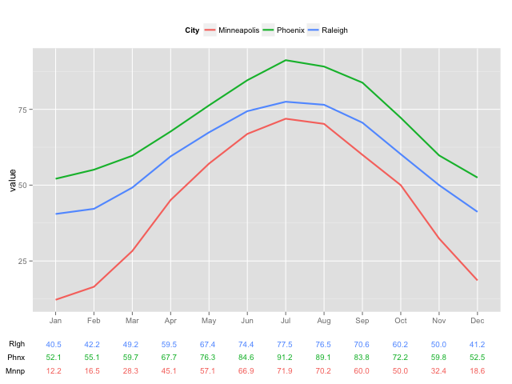
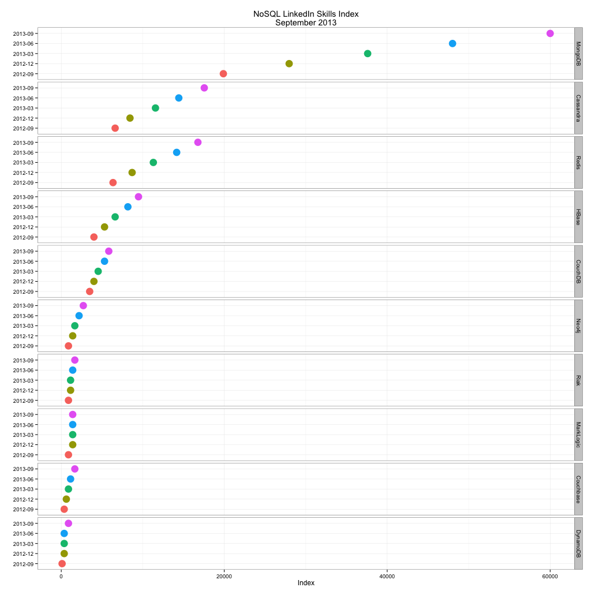
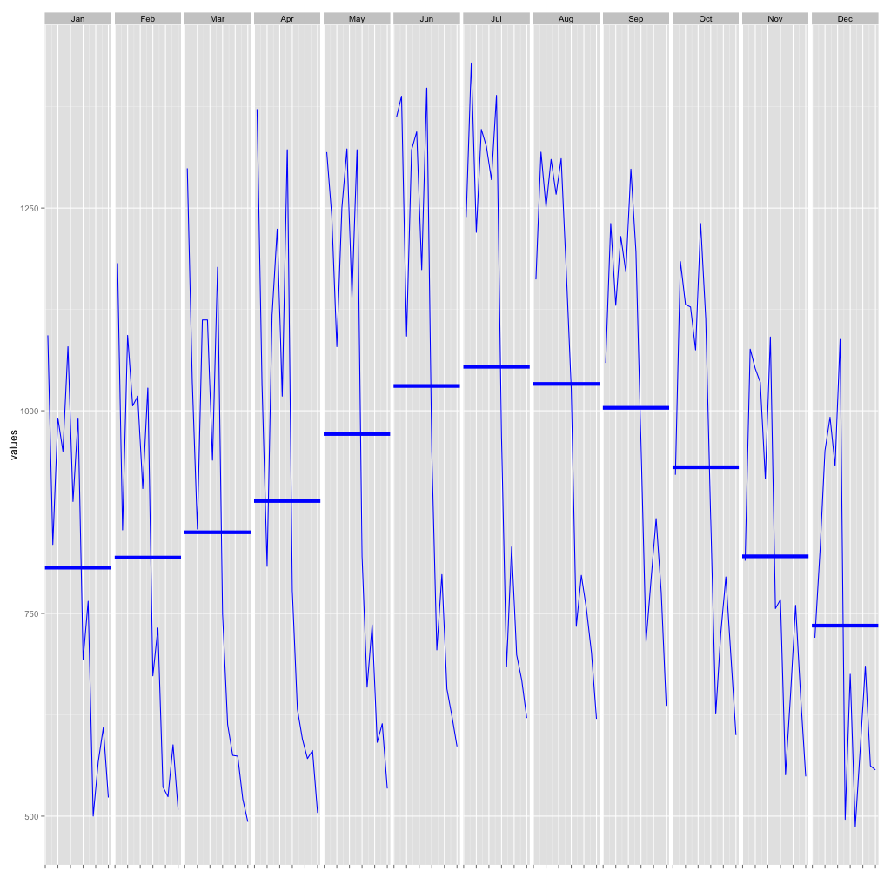

# R Visualizations Gallery

This repository is a personal scratchpad that I'm working on that documents how to implement data visualizations in R for problems I've encountered. Where I've based (or simply copied) work done by others I've referenced the original source.

## [Creating a Plot with a Data Table](http://github.com/rbdixon/R-visualizations/blob/master/plot_with_data_table.R)

## [Faceted Dot-plot](http://github.com/rbdixon/R-visualizations/blob/master/faceted_dot_plot.R)

Bar and column plots are often abused when the origin is not anchored at zero. Dot-plots are the recommended solution for situations where comparisons need to be made between values but the axis origin needs to begin somewhere other than zero in order to differentiate between close values.

## [Cycle Plot](http://github.com/rbdixon/R-visualizations/blob/master/cycle_plot.R)

Time series data with a cyclical component, such as monthly sales or page views, can have a seasonal component. Examples might include a backend-loaded sales forecast or page views that drop on the weekend. Cycle plots can help to display both the trend and compare the variations between sub-periods.

