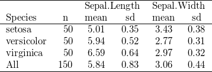

# Making fancy tables in knitr Markdown documents


Standard `xtable` doesn't really do what I want. The formatting options are limited.

```r
print(xtable(head(iris)), type = "html", html.table.attributes = "")
```

<!-- html table generated in R 3.0.1 by xtable 1.7-1 package -->
<!-- Thu Nov  7 12:17:09 2013 -->
<TABLE >
<TR> <TH>  </TH> <TH> Sepal.Length </TH> <TH> Sepal.Width </TH> <TH> Petal.Length </TH> <TH> Petal.Width </TH> <TH> Species </TH>  </TR>
  <TR> <TD align="right"> 1 </TD> <TD align="right"> 5.10 </TD> <TD align="right"> 3.50 </TD> <TD align="right"> 1.40 </TD> <TD align="right"> 0.20 </TD> <TD> setosa </TD> </TR>
  <TR> <TD align="right"> 2 </TD> <TD align="right"> 4.90 </TD> <TD align="right"> 3.00 </TD> <TD align="right"> 1.40 </TD> <TD align="right"> 0.20 </TD> <TD> setosa </TD> </TR>
  <TR> <TD align="right"> 3 </TD> <TD align="right"> 4.70 </TD> <TD align="right"> 3.20 </TD> <TD align="right"> 1.30 </TD> <TD align="right"> 0.20 </TD> <TD> setosa </TD> </TR>
  <TR> <TD align="right"> 4 </TD> <TD align="right"> 4.60 </TD> <TD align="right"> 3.10 </TD> <TD align="right"> 1.50 </TD> <TD align="right"> 0.20 </TD> <TD> setosa </TD> </TR>
  <TR> <TD align="right"> 5 </TD> <TD align="right"> 5.00 </TD> <TD align="right"> 3.60 </TD> <TD align="right"> 1.40 </TD> <TD align="right"> 0.20 </TD> <TD> setosa </TD> </TR>
  <TR> <TD align="right"> 6 </TD> <TD align="right"> 5.40 </TD> <TD align="right"> 3.90 </TD> <TD align="right"> 1.70 </TD> <TD align="right"> 0.40 </TD> <TD> setosa </TD> </TR>
   </TABLE>


`tabular` is better but doesn't look as nice once included.

```r
tabular((Species + 1) ~ (n = 1) + Format(digits = 2) * (Sepal.Length + Sepal.Width) * 
    (mean + sd), data = iris)
```

```
##                                                   
##                 Sepal.Length      Sepal.Width     
##  Species    n   mean         sd   mean        sd  
##  setosa      50 5.01         0.35 3.43        0.38
##  versicolor  50 5.94         0.52 2.77        0.31
##  virginica   50 6.59         0.64 2.97        0.32
##  All        150 5.84         0.83 3.06        0.44
```


Why not try rendering to PNG and see if that's a better approach?


```r
tabular.png("rmarkdown_fancytables", (Species + 1) ~ (n = 1) + Format(digits = 2) * 
    (Sepal.Length + Sepal.Width) * (mean + sd), data = iris)
```

```
## Loading required package: tools
```




*References*
* [Print latex table to png](http://stackoverflow.com/questions/9298765/print-latex-table-directly-to-an-image-png-or-other)
* [Include image programatically](http://stackoverflow.com/questions/11096870/include-images-programmatically-in-md-document-from-within-r-chunk-using-knitr)
